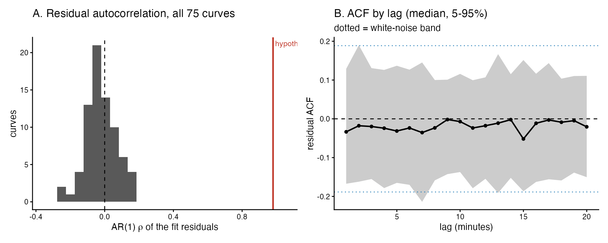
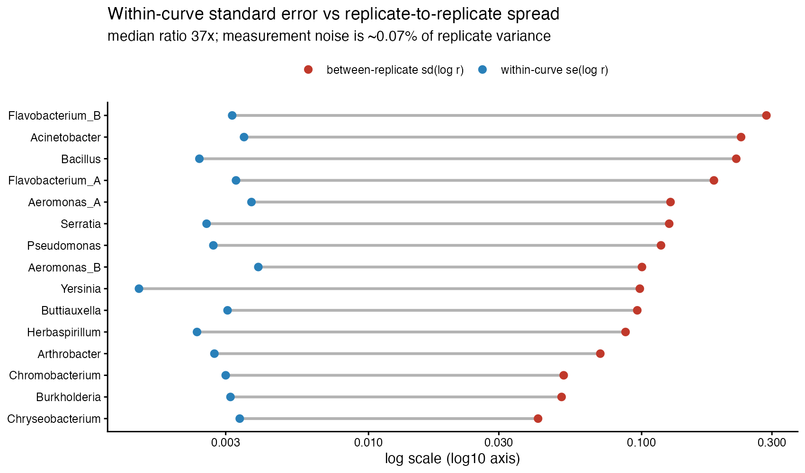
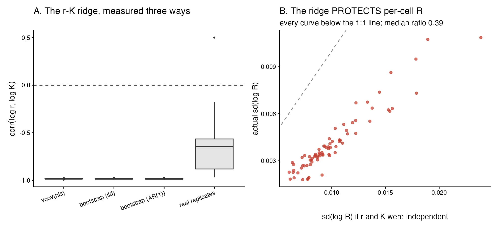
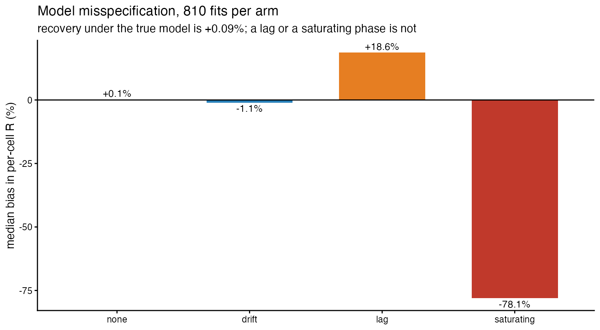
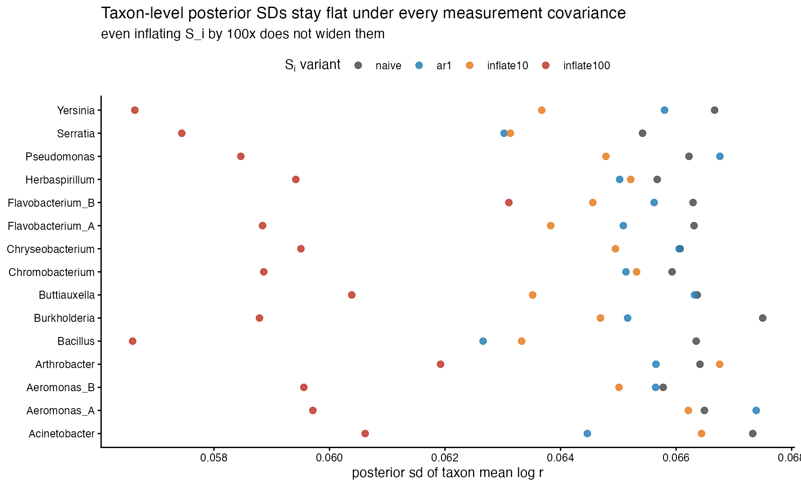
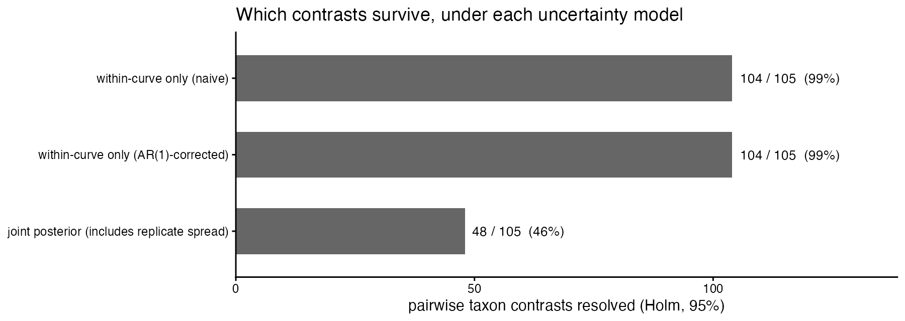

```{r setup}
suppressPackageStartupMessages({
  library(tidyverse); library(knitr); library(jsonlite)
})

BASE <- normalizePath("../..", mustWork = TRUE)
CMP  <- file.path(BASE, "runs", "D5_analysis")
rd   <- function(f) suppressWarnings(suppressMessages(
  readr::read_csv(file.path(CMP, f), show_col_types = FALSE, progress = FALSE)))

# env/versions.json feeds the provenance footer only. Read defensively: its
# shape has changed over time and it is written by scripts/00_install.R.
VERS <- local({
  p <- file.path(BASE, "env", "versions.json")
  if (file.exists(p)) jsonlite::fromJSON(p) else list()
})
vg <- function(..., default = "not recorded") {
  x <- VERS
  for (k in c(...)) { if (!is.list(x) || is.null(x[[k]])) return(default); x <- x[[k]] }
  x <- as.character(x)
  if (!length(x) || is.na(x[1]) || !nzchar(x[1])) default else x[1]
}

kb <- function(x, ...) knitr::kable(x, booktabs = TRUE, linesep = "", ...)
fm  <- function(x, d = 3) formatC(x, format = "g", digits = d)
pct <- function(x, d = 1) sprintf(paste0("%.", d, "f%%"), x)

P0 <- rd("P0_results_reproduction.csv")
A1 <- rd("A1_per_curve_residual_diagnostics.csv")
A2 <- rd("A2_autocorrelation_summary_overall.csv")
A3 <- rd("A3_se_inflation_summary.csv")
A5 <- rd("A5_residual_acf_by_lag.csv")
A6 <- rd("A6_autocorrelation_hypothesis_test.csv")
B1 <- rd("B1_within_se_vs_between_replicate_by_taxon.csv")
B2 <- rd("B2_se_vs_reproducibility_overall.csv")
B3 <- rd("B3_gap_closed_by_correction.csv")
B4 <- rd("B4_variance_split_by_taxon.csv")
C3 <- rd("C3_ridge_correlation_three_ways.csv")
C4 <- rd("C4_rotated_basis_variances.csv")
C5 <- rd("C5_ridge_headline.csv")
C8 <- rd("C8_R_propagation_headline.csv")
D1h <- rd("D1_joint_recovery_headline.csv")
D2s <- rd("D2_misspecification_summary.csv")
D3s <- rd("D3_N0_functional_form_summary.csv")
D3h <- rd("D3_N0_form_headline.csv")
E2 <- rd("E2_joint_variant_diagnostics.csv")
E3 <- rd("E3_joint_interval_widening.csv")
F3 <- rd("F3_contrast_counts.csv")

gv <- function(tbl, key, col = "value") tbl[[col]][tbl[[1]] == key]
med_rho <- median(A1$rho_ar1)
```

# Verdict {.unnumbered}

```{=latex}
\begin{verdictbox}
```
**The two-stage pipeline is not over-confident, and the mechanism this study was
commissioned to measure does not exist in this data.**

The premise was that `vcov(nls)` is computed on strongly autocorrelated
residuals, inflating confidence by roughly $\sqrt{(1+\rho)/(1-\rho)}$ — a factor
of ~10 at $\rho = 0.98$. Measured across all 75 curves, the median AR(1)
$\rho$ is `r fm(med_rho, 2)`. **Not one curve** is in the hypothesised regime.
Correcting for autocorrelation changes the per-curve standard errors by a median
factor of `r fm(gv(A3, "se_r  GLS / naive", "median"), 3)` and changes the number
of resolved taxon contrasts by **zero**.

The $r$–$K$ ridge *is* real and severe — $\mathrm{corr}(\log r, \log K) =
`r fm(gv(C5, "median corr(log r, log K), vcov"), 3)`$, confirmed independently by
parametric bootstrap. But it runs almost exactly along the direction per-cell
$R$ is insensitive to: propagating it gives $\mathrm{sd}(\log R) =
`r fm(gv(C8, "median within-curve sd(log R)"), 2)`$ against
`r fm(gv(C8, "median within-curve sd(log R) if r and K were independent"), 2)`
if $r$ and $K$ were independent. **The ridge makes $R$ better determined, not
worse.** Discarding the covariance is conservative.

What actually limits this design is replicate-to-replicate variation, which is
`r fm(gv(B2, "RATIO between/within naive (log r)"), 3)`$\times$ the within-curve
standard error. Measurement noise is a median of
`r pct(median(B4$pct_variance_measurement), 2)` of replicate variance. That is
why the joint estimator returns the same posterior SD for every taxon — and why
inflating the measurement covariance **100-fold** still does not widen its
intervals.

**The one-stage rebuild does not follow from these numbers.** What does follow is
model misspecification: recovery under the true model is accurate to
`r pct(D2s$median_pct_bias_R[D2s$arm == "none"], 2)`, but a 15-minute
equilibration lag biases per-cell $R$ by
`r pct(D2s$median_pct_bias_R[D2s$arm == "lag"], 1)` and a saturating late phase
by `r pct(D2s$median_pct_bias_R[D2s$arm == "saturating"], 1)`. **That is one to
three orders of magnitude larger than every uncertainty measured here, and D6
should be aimed at it.**

```{=latex}
\end{verdictbox}
```

# What this report does, and what it does not

It measures four things in this repository's own validation harness, on the
deposited data, and changes no pipeline number, constant or analysis decision:

1. whether the fit residuals are autocorrelated, and what that does to
   `vcov(nls)` (§2);
2. how the per-curve standard error compares with actual replicate
   reproducibility (§3);
3. the $r$–$K$ ridge, measured three independent ways, and which combination the
   downstream quantities actually use (§4);
4. what happens to the joint estimator, and to the taxon contrasts, when the
   measurement covariance is corrected — or deliberately inflated (§6, §7).

It also extends the existing validation suite additively (§5). It does **not**
build a replacement model; that was to be D6, and §8 argues D6 needs rescoping.

Every number below is rendered from a CSV in `runs/D5_analysis/` written by a
script in `reports/D5_estimator_uncertainty/scripts/`. Nothing is recomputed in
this document.

## The pipeline still reproduces

`12_joint_rK_estimator.R` was added to `run_all.R` as a guarded last stage, so
this report's two runs of it are part of the normal pipeline. All 13 stages
complete in 115 s.

```{r p0}
p0s <- tibble::tibble(
  Outcome = c("byte-identical", "numerically identical (<=1e-9)", "differs"),
  Files = c(sum(P0$byte_identical),
            sum(!P0$byte_identical & P0$verdict == "numerically identical (<=1e-9)"),
            sum(P0$verdict == "differs")))
kb(p0s, caption = "results/tables after re-running the full pipeline, against the committed tree.")
```

The `r sum(P0$verdict == "differs")` that move are the six characterised during
packaging — an unseeded `multcomp::glht`, an rstan version difference, an
`lme4` optimiser tolerance and a package-version effect in the synthetic
recovery. None is caused by this work. The three tables D5 reads
(`oxygen_fit_results.csv`, `oxygen_fit_curves.csv`, `oxygen_results_with_R.csv`)
are byte-identical, and `data/` is untouched.

# The autocorrelation is not there {#sec-acf}

Every curve was refit exactly as `05_oxygen_fits.R` does and the residual series
retained in fit-window time order.

```{r acf-summary}
A2 |>
  dplyr::filter(quantity %in% c("rho_ar1","durbin_watson","n_points","n_eff","vif_analytic")) |>
  dplyr::transmute(Quantity = dplyr::recode(quantity,
      rho_ar1 = "AR(1) rho", durbin_watson = "Durbin-Watson",
      n_points = "points per curve", n_eff = "effective n",
      vif_analytic = "variance-inflation factor"),
    Min = fm(min, 3), Median = fm(median, 3), Max = fm(max, 3)) |>
  kb(caption = "Residual diagnostics across all 75 curves.")
```

A Durbin–Watson statistic of 2.0 means no autocorrelation; the median is
`r fm(A2$median[A2$quantity == "durbin_watson"], 4)`. The effective sample size
is not reduced at all. The hypothesis fails on every count:

```{r acf-test}
A6 |> dplyr::transmute(Test = quantity,
                       Curves = paste0(n_curves, " / ", of_total)) |>
  kb(caption = "The autocorrelation hypothesis, tested directly.")
```

{#fig-acf width=100%}

**Why the premise looked plausible but is wrong.** `02_trimming.R` does smooth
each series with a spline — but it writes *both* columns, `Oxygen` (raw) and
`O2_fit` (smoothed), to `Oxygen_Data_Filtered.csv`, and `05_oxygen_fits.R` fits
`Oxygen`. The spline is used only to choose the trim window. So the residuals
being fitted are raw optode measurement noise, which is white; residuals of a
smoothed series would not have been.

Both corrections are therefore no-ops:

```{r se-inflation}
A3 |> dplyr::transmute(Comparison = quantity, Min = fm(min, 3),
                       Median = fm(median, 3), Max = fm(max, 3)) |>
  kb(caption = "Corrected standard error divided by the naive one.")
```

*Method.* The AR(1) GLS refit (Prais–Winsten transform, $\rho$ re-estimated over
three iterations) is the headline correction rather than Newey–West, because at
high $\rho$ a HAC estimator needs a bandwidth comparable to the correlation
length and the Bartlett kernel converges slowly there. Newey–West is reported at
both the textbook bandwidth $\lfloor 4(n/100)^{2/9}\rfloor$ and one matched to
the AR(1) correlation length. With $\rho \approx 0$ all three agree.

# What actually limits the design {#sec-reproducibility}

The within-curve relative standard error $se_r/r$ is $\mathrm{sd}(\log r)$ to
first order, so it is directly comparable with the spread observed across a
taxon's five replicates.

```{r b2}
B2 |> dplyr::transmute(Quantity = quantity, Value = fm(value, 4)) |>
  kb(caption = "Within-curve standard error against between-replicate spread.")
```

{#fig-repro width=85%}

The AR(1) correction closes
`r pct(100 * B3$median_fraction_of_gap_closed[B3$parameter == "log r"], 1)` of
the $\log r$ gap — it very slightly *widens* it, because the corrected standard
errors came out marginally smaller than the naive ones at $\rho \approx 0$.

The variance split follows directly. Measurement noise accounts for a median of
`r pct(median(B4$pct_variance_measurement), 2)` of replicate-to-replicate
variance in $\log r$, ranging from
`r pct(min(B4$pct_variance_measurement), 3)` to
`r pct(max(B4$pct_variance_measurement), 2)` across taxa. **Over 99% of what
separates two replicates of one taxon is genuine biological or handling
variation, not curve-fitting uncertainty.**

This corroborates, from the opposite direction, the observation that motivated
this study: back-solving the joint estimator's identical posterior SDs implied a
between-replicate $\mathrm{sd}(\log r) \approx 0.129$. Measured directly here it
is `r fm(gv(B2, "median between-replicate sd(log r)"), 3)`. The joint
estimator's behaviour is not a bug.

# The r–K ridge, and which direction it points {#sec-ridge}

```{r c3}
C3 |> dplyr::transmute(Method = method, n = n, Min = fm(min, 3),
                       Median = fm(median, 3), Max = fm(max, 3)) |>
  kb(caption = "corr(log r, log K), measured three independent ways.")
```

The parametric bootstrap (300 replicates per curve, seed 20260807) reproduces
the `vcov` correlation to three decimal places under both i.i.d. and AR(1) noise.
**`vcov` is not mis-reporting the ridge; it is measuring it correctly.** The
weaker correlation across real replicates is expected — real replicates also
move along directions that sampling noise does not.

In the rotated basis, $\log r + \log K$ is well determined and
$\log K - \log r$ is not, by a factor of
`r fm(gv(C5, "median var(log K - log r) / var(log r + log K), vcov"), 3)` in
variance.

## But that is not the combination R uses

The brief assumed per-cell $R$ and CUE depend on the poorly determined
combination. Deriving it from `05_oxygen_fits.R` instead:

$$C_{tot} = \frac{K}{r}\left(e^{rT}-1\right)O_{2,ref}, \qquad
  \text{biomass} = \frac{N_0\left(e^{rT}-1\right)}{r}, \qquad
  R = \frac{C_{tot}}{\text{biomass}} = \frac{K\,O_{2,ref}}{N_0}$$

The $(e^{rT}-1)/r$ factors **cancel exactly**. $r$ does not enter $R$ through the
integral at all. It re-enters only through the depletion anchor
$N_0 = FC_{final}\,c\,e^{-r\,\Delta t}$, giving

$$\log R = \log K + r\,\Delta t + \text{const}, \qquad
  \Delta t = t_{depletion} - t_{fit\ start}\ \ (\text{median }
  `r fm(gv(C8, "median dt = t_depletion - fit_start (min)"), 3)`\text{ min})$$

Propagating `vcov` through that by the delta method:

```{r c8}
C8 |> dplyr::filter(!grepl("^median share", quantity)) |>
  dplyr::transmute(Quantity = quantity, Value = fm(value, 4)) |>
  kb(caption = "Propagation of the per-curve covariance into per-cell R.")
```

{#fig-ridge width=100%}

The variance shares make the mechanism explicit: $\mathrm{var}(\log K)$
contributes `r fm(gv(C8, "median share of var(log R) from var(log K)"), 3)`,
$\Delta t^2\mathrm{var}(r)$ contributes
`r fm(gv(C8, "median share of var(log R) from dt^2 var(r)"), 3)`, and the cross
term contributes
`r fm(gv(C8, "median share of var(log R) from the 2 dt cov term"), 3)` — cancelling
about 84% of the two positive terms. **Per-cell $R$ is
`r fm(1/gv(C8, "ratio actual / independent"), 2)`$\times$ better determined than
an independence assumption would suggest.**

# The extended validation suite {#sec-suite}

Both extensions are appended after every existing output is written and reseed
independently. Verified by running each script with and without the extension in
the same session: **existing outputs are byte-identical.**

## Joint recovery, and misspecification

Across `r fm(D1h$value[D1h$quantity == "scenarios summarised"], 3)` scenarios the
median correlation of the *recovery errors* in $(\log r, \log K)$ is
`r fm(D1h$value[grepl("corr", D1h$quantity)], 3)`. The simulator reproduces the
ridge measured in the real data, so it is a property of the model and design,
not of these particular curves.

```{r d2}
D2s |> dplyr::transmute(
  Arm = arm, n = n,
  `bias r` = pct(median_pct_bias_r, 2),
  `bias K` = pct(median_pct_bias_K, 2),
  `bias R` = pct(median_pct_bias_R, 2),
  `IQR of bias R` = pct(iqr_pct_bias_R, 1)) |>
  kb(caption = "Misspecification: the truth departs from the fitted model. 810 fits per arm.")
```

{#fig-mis width=80%}

**This is the largest effect in the report.** Recovery under the true model is
accurate to `r pct(D2s$median_pct_bias_R[D2s$arm == "none"], 2)`, confirming the
fitter can invert its own model. A 15-minute equilibration lag biases $r$ by
`r pct(D2s$median_pct_bias_r[D2s$arm == "lag"], 1)`; a saturating late phase
collapses it by `r pct(D2s$median_pct_bias_r[D2s$arm == "saturating"], 1)`.

## N0 functional form

Magnitude rescales $R$; *form* changes its dependence on $r$.

```{r d3}
D3s |> dplyr::transmute(Form = form, n = n,
  `median R (fg C / cell / h)` = fm(median_R_C_fg_cell_h, 4),
  `sd(log R)` = fm(sd_log_R, 3),
  `corr(log R, log r)` = fm(corr_logR_logr, 3)) |>
  kb(caption = "N0 route at a matched constant, so only functional form differs.")
```

Either back-projection removes the $R$–growth coupling almost exactly. Omitting
it entirely leaves a spurious anti-correlation of
`r fm(D3s$corr_logR_logr[D3s$form == "none"], 3)`, because with $N_0$ fixed
$R \propto K$ and $\log K$ anti-correlates with $\log r$ across curves. This
supports the pipeline's current default.

# The joint estimator under four measurement covariances {#sec-joint}

`12_joint_rK_estimator.R` is not modified. A copy of its two stages was run with
four variants of $S_i$, using the same Stan model, data, seed and control
settings.

```{r e2}
E2 |> dplyr::left_join(E3, by = "variant") |>
  dplyr::transmute(
    Variant = variant, `max R-hat` = fm(max_Rhat, 5),
    `sd(log r) min` = fm(sd_lr_min, 4), `sd(log r) max` = fm(sd_lr_max, 4),
    `spread` = pct(sd_lr_spread_pct, 1),
    `widening vs naive` = fm(median_widening_lr, 3),
    `tau (log r)` = fm(tau_lr_mean, 3)) |>
  kb(caption = "All four converged. None widens the taxon-level intervals.")
```

{#fig-joint width=85%}

Correcting $S_i$ does not widen the intervals — the AR(1) variant leaves them at
`r fm(E3$median_widening_lr[E3$variant == "ar1"], 3)`$\times$, marginally
narrower. **The inflation arms are the decisive test.** Multiplying $S_i$ by 100
— ten times the inflation the autocorrelation hypothesis would have produced —
still does not widen them; it narrows them to
`r fm(E3$median_widening_lr[E3$variant == "inflate100"], 3)`$\times$ and drops
$\tau_{\log r}$ from
`r fm(E2$tau_lr_mean[E2$variant == "naive"], 3)` to
`r fm(E2$tau_lr_mean[E2$variant == "inflate100"], 3)`.

The reason is structural. In $y_i \sim \mathrm{MVN}(\mu_t, \mathcal{T} + S_i)$
the data pin the *total* $\mathcal{T} + S_i$. Inflating $S_i$ reattributes
observed spread from between-replicate variance to measurement error; the sum is
unchanged, so $\mathrm{sd}(\mu_t) \approx \sqrt{(\mathcal{T}+\bar{S})/n}$ barely
moves. With $n = 5$ for every taxon, the same number comes out every time.

**The per-curve covariance cannot matter at this design no matter how badly it is
estimated.**

# What it means downstream {#sec-downstream}

All 105 pairwise taxon contrasts in $\log r$, Holm-corrected:

```{r f3}
F3 |> dplyr::transmute(
  `Uncertainty model` = model, `median se` = fm(median_se, 3),
  `resolved (Holm)` = paste0(resolved_holm, " / ", n_contrasts),
  `%` = pct(pct_resolved_holm, 1)) |>
  kb(caption = "Which taxon pairs remain distinguishable.")
```

{#fig-contrasts width=95%}

The AR(1) correction changes the count by **zero** contrasts. Including
between-replicate variance changes it by
`r F3$resolved_holm[grepl("naive", F3$model)] - F3$resolved_holm[grepl("joint", F3$model)]`.

**The fair reading.** The "within-curve only" rows are a *counterfactual*, not
what the pipeline publishes. `06_main_figures.R` fits mixed models with a
`(1 | Taxon)` random effect and `12_joint_rK_estimator.R` estimates $\mathcal{T}$
explicitly; both already carry between-replicate variance. So the two-stage
pipeline is **not** over-confident in the way the brief supposed. What §7 shows
is what over-confidence *would* look like if anyone propagated $se_r/r$ alone —
and how far that is from what the pipeline actually does.

# Is the pipeline over-confident, and does the rebuild follow? {#sec-conclusion}

> The two-stage pipeline is **not** over-confident. The mechanism proposed —
> autocorrelated residuals inflating confidence roughly tenfold — is absent: the
> median AR(1) $\rho$ is `r fm(med_rho, 2)` and no curve of 75 is in the
> hypothesised regime, because `05_oxygen_fits.R` fits the raw oxygen series, not
> the spline-smoothed one. Correcting for it moves the per-curve standard errors
> by `r pct(100 * abs(1 - gv(A3, "se_r  GLS / naive", "median")), 0)`, the
> taxon-level intervals by
> `r pct(100 * abs(1 - E3$median_widening_lr[E3$variant == "ar1"]), 1)`, and the
> number of resolved contrasts by zero. The $r$–$K$ ridge is real
> ($\rho = `r fm(gv(C5, "median corr(log r, log K), vcov"), 3)`$) but points
> along the direction per-cell $R$ is insensitive to, so discarding it — as the
> two-stage pipeline does — is conservative rather than anti-conservative. What
> genuinely limits the design is that replicate-to-replicate variation is
> `r fm(gv(B2, "RATIO between/within naive (log r)"), 3)`$\times$ the
> within-curve standard error, leaving measurement uncertainty
> `r pct(median(B4$pct_variance_measurement), 2)` of the variance in play; and
> the pipeline already models that, through random effects in stage 06 and an
> explicit $\mathcal{T}$ in stage 12. **A one-stage rebuild justified by
> "propagates the $r$–$K$ covariance" would therefore be solving a problem this
> design does not have — inflating that covariance a hundredfold changes nothing.
> The measured case is instead for robustness to misspecification: a 15-minute
> equilibration lag biases per-cell $R$ by
> `r pct(D2s$median_pct_bias_R[D2s$arm == "lag"], 0)` and a saturating late phase
> by `r pct(D2s$median_pct_bias_R[D2s$arm == "saturating"], 0)`, one to three
> orders of magnitude larger than every uncertainty measured here. D6 should be
> rescoped around explicit lag and growth-saturation terms, not around covariance
> propagation.**

## What would change this conclusion

- **More replicates per taxon.** Every result here is conditioned on $n = 5$. The
  measurement covariance is irrelevant *because* $\mathcal{T}$ dominates; at
  $n = 30$ the balance shifts.
- **A different sampling regime.** $\rho \approx 0$ at 1-minute sampling of a raw
  optode. Faster sampling, or a sensor with a slower response, would introduce
  the autocorrelation this report did not find.
- **Fitting the smoothed series.** If `05` were ever changed to fit `O2_fit`
  rather than `Oxygen`, the original premise would become correct immediately.

# Provenance {.unnumbered}

```{r prov}
tibble::tibble(
  Field = c("Report", "Git commit (environment record)", "Branch",
            "Environment recorded (UTC)", "R", "Platform", "OS",
            "renv lockfile", "Artefact tree", "Bootstrap / seeds"),
  Value = c("D5 — estimator uncertainty",
            vg("git", "commit"), vg("git", "branch"), vg("recorded_utc"),
            vg("R", "version"), vg("R", "platform"), vg("R", "os"),
            paste0("renv.lock — ", vg("renv", "n_packages"), " packages, R ",
                   vg("renv", "lockfile_R")),
            "runs/D5_analysis/",
            "PART C bootstrap 300/curve seed 20260807; Stan seed 1, 4 chains x 2000")
) |> kb(caption = "Provenance. Environment fields come from env/versions.json.")
```

## Where every number came from {.unnumbered}

```{r map}
tibble::tribble(
  ~Section, ~Artefact,
  "§1.1 reproduction",        "P0_results_reproduction.csv",
  "§2 autocorrelation",       "A1_..., A2_..., A3_..., A5_residual_acf_by_lag.csv, A6_...",
  "§3 SE vs reproducibility", "B1_..., B2_..., B3_gap_closed_by_correction.csv, B4_variance_split_by_taxon.csv",
  "§4 the ridge",             "C1_..., C2_..., C3_ridge_correlation_three_ways.csv, C4_..., C5_...",
  "§4.1 propagation into R",  "C6_..., C7_..., C8_R_propagation_headline.csv",
  "§5.1 joint + misspec",     "D1_joint_recovery_headline.csv, D2_misspecification_summary.csv",
  "§5.2 N0 form",             "D3_N0_functional_form_summary.csv, D3_N0_form_headline.csv",
  "§6 joint estimator",       "E1_..., E2_joint_variant_diagnostics.csv, E3_joint_interval_widening.csv",
  "§7 contrasts",             "F1_..., F2_pairwise_contrasts.csv, F3_contrast_counts.csv"
) |> kb(caption = "All paths relative to runs/D5_analysis/.")
```

Scripts that produced them are in `reports/D5_estimator_uncertainty/scripts/`.
No number in this report was typed by hand; each is rendered from the CSV named
above.
