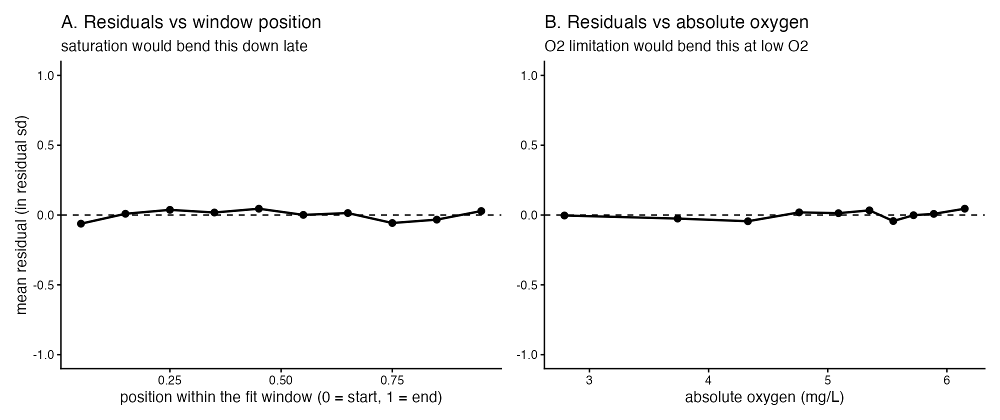
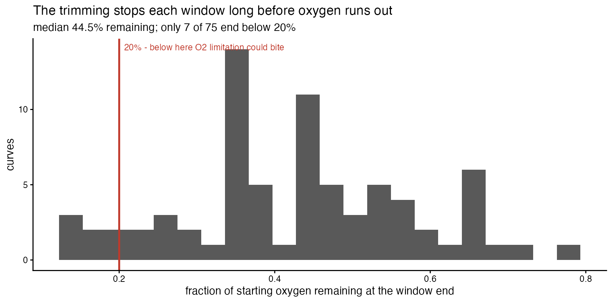
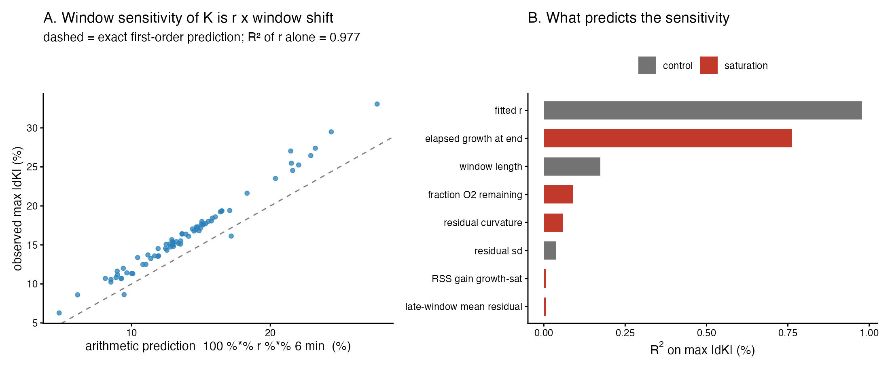
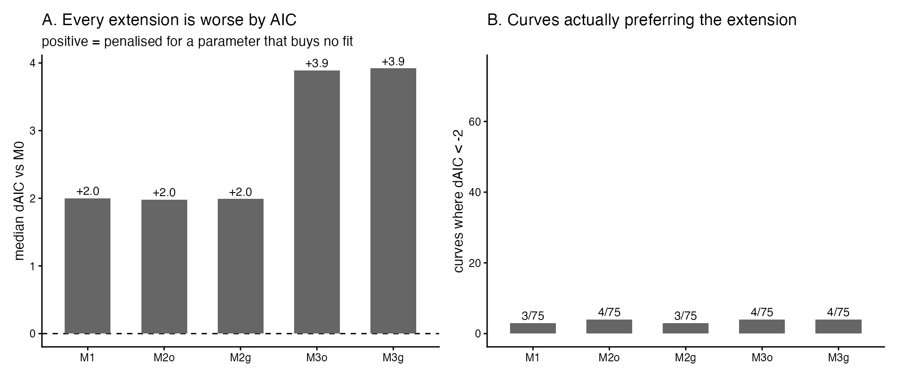
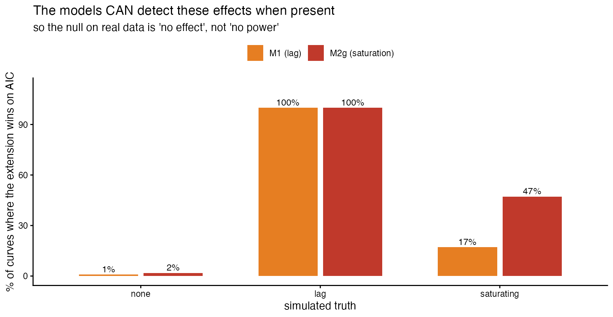
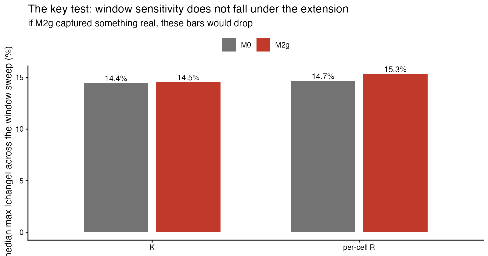

```{r setup}
suppressPackageStartupMessages({
  library(tidyverse); library(knitr); library(jsonlite)
})

BASE <- normalizePath("../..", mustWork = TRUE)
CMP  <- file.path(BASE, "runs", "D6_analysis")
rd   <- function(f) suppressWarnings(suppressMessages(
  readr::read_csv(file.path(CMP, f), show_col_types = FALSE, progress = FALSE)))

VERS <- local({
  p <- file.path(BASE, "env", "versions.json")
  if (file.exists(p)) jsonlite::fromJSON(p) else list()
})
vg <- function(..., default = "not recorded") {
  x <- VERS
  for (k in c(...)) { if (!is.list(x) || is.null(x[[k]])) return(default); x <- x[[k]] }
  x <- as.character(x)
  if (!length(x) || is.na(x[1]) || !nzchar(x[1])) default else x[1]
}
kb <- function(x, ...) knitr::kable(x, booktabs = TRUE, linesep = "", ...)
fm  <- function(x, d = 3) formatC(x, format = "g", digits = d)
pct <- function(x, d = 1) sprintf(paste0("%.", d, "f%%"), x)

A1 <- rd("A1_residual_structure_per_curve.csv")
A4 <- rd("A4_deviation_counts.csv")
A5 <- rd("A5_mechanism_discrimination.csv")
B2 <- rd("B2_correlations.csv")
B3 <- rd("B3_variance_explained.csv")
B4 <- rd("B4_headline.csv")
B5 <- rd("B5_arithmetic_explanation.csv")
C2 <- rd("C2_model_summary.csv")
C3 <- rd("C3_vs_M0.csv")
C4 <- rd("C4_extra_parameters.csv")
D1 <- rd("D1_power_check.csv")
D3 <- rd("D3_window_sweep_by_model.csv")
D4 <- rd("D4_ordering_and_fig6.csv")

gv <- function(tb, key, col = "value") tb[[col]][tb[[1]] == key]
```

# Verdict {.unnumbered}

```{=latex}
\begin{verdictbox}
```
**Neither vulnerability is present in the real curves, and the current model is
adequate. No change to the default estimator follows from these numbers.**

D5 measured, in simulation, that an equilibration lag biases per-cell $R$ by
+18.6% and a saturating growth phase by −78.1%. D6 asked whether either is
actually there. Neither is:

* A nested F-test against each saturating alternative rejects at chance level —
  `r A4$n_curves[1]`/`r A4$of_total[1]` curves for growth saturation,
  `r A4$n_curves[3]`/`r A4$of_total[3]` for O₂ limitation — and the extra term
  buys a median RSS reduction of
  `r pct(100 * median(A1$rss_gain_growth, na.rm = TRUE), 3)`.
* **The reason is the trimming.** The median window still holds
  `r pct(100 * median(A1$O2_frac_remaining), 1)` of its starting oxygen when the
  fit ends, and only `r A4$n_curves[7]` of `r A4$of_total[7]` end below 20%. O₂
  limitation cannot bite there. D5's −78.1% arm was pessimistic *about this data*
  because it let growth run to carrying capacity inside the window.

**The window-sensitivity hypothesis fails, and the real explanation is
arithmetic.** All six saturation measures together explain
$R^2 = `r fm(gv(B4, "R^2, all saturation measures -> max|dR_pct|"), 3)`$ of the
per-curve movement in $R$. Fitted $r$ alone explains
$R^2 = `r fm(gv(B5, "R^2 of fitted r alone on max|dK_pct|"), 3)`$ of the movement
in $K$ — because shifting a window edge by $\Delta$ on a curve growing at rate
$r$ changes the oxygen consumed by $\approx e^{r\Delta}$, so $K$ must move by
$\approx r\Delta$. The prediction is
`r pct(gv(B5, "arithmetic prediction 100*r*6 (%)"), 1)` against an observed
`r pct(gv(B5, "observed median max|dK_pct| (%)"), 1)`.

**This is "no effect", not "no power."** On simulated curves carrying a planted
15-minute lag, the lag model wins on AIC in
`r pct(D1$pct_M1_preferred[D1$arm == "lag"], 0)` of cases and recovers the lag at
a median of `r fm(D1$median_tlag_hat[D1$arm == "lag"], 4)` minutes — exact. On
clean curves it is correctly rejected at
`r pct(D1$pct_M1_preferred[D1$arm == "none"], 1)`.

**And the key test agrees.** Window sensitivity does not fall under the
extension: median max$|\Delta K|$ is
`r pct(D3$median_max_dK_pct[D3$model == "M0"], 1)` under M0 against
`r pct(D3$median_max_dK_pct[D3$model == "M2g"], 1)` under M2g. Between-taxon
ordering of per-cell $R$ is identical (Spearman 1.000) under every model. **No
published conclusion moves.**

```{=latex}
\end{verdictbox}
```

# What this report does

D5 established that uncertainty propagation is not this pipeline's problem, and
pointed instead at bias from misspecification. It measured, in simulation:

| arm | bias in per-cell R |
|---|---|
| none | +0.09% |
| optode drift | −1.1% |
| initial lag | **+18.6%** |
| saturating growth | **−78.1%** |

D6 asks whether lag or saturation is present in the 75 real curves, and if so
what a corrected model does. It changes no pipeline number, constant or analysis
decision: every model here is an **additional** fit writing to
`runs/D6_analysis/`.

Every number below is rendered from a CSV in that directory. Nothing is
recomputed in this document.

# Is saturation present? {#sec-present}

Each curve was refit over its committed window and the residuals examined
against time-in-window and against absolute oxygen. The two mechanisms make
different predictions — O₂ limitation scales with absolute O₂, growth saturation
with elapsed growth — which is what makes them separable in principle.

{#fig-resid width=100%}

```{r a4}
A4 |> dplyr::transmute(Test = test, Curves = paste0(n_curves, " / ", of_total)) |>
  kb(caption = "Detectable deviation from the current model.")
```

*Method note, because the first attempt was wrong.* A RESET-style regression of
the residuals on the squared fitted value returned $p \geq 0.95$ for all 75
curves. That is not evidence of no effect — it is a degenerate test: for this
three-parameter model $\hat{y}^2$ lies almost entirely in the span of the
Jacobian, so the residuals are orthogonal to it by construction. It was
discarded and replaced with a nested F-test against each saturating alternative,
which is valid because M0 is the growth-saturation model at
$N_{max} \to \infty$ and the O₂-limitation model at $K_m \to 0$. The counts above
are from that test.

## Why there is nothing to find

{#fig-windows width=80%}

```{r a1sum}
tibble::tibble(
  Quantity = c("O2 remaining at window end", "N-fold growth at window end",
               "late-window mean residual (in sd)"),
  Min = c(pct(100*min(A1$O2_frac_remaining),1), fm(min(A1$Nfold_at_end),3),
          fm(min(A1$late_mean_sd, na.rm=TRUE),2)),
  Median = c(pct(100*median(A1$O2_frac_remaining),1), fm(median(A1$Nfold_at_end),3),
             fm(median(A1$late_mean_sd, na.rm=TRUE),2)),
  Max = c(pct(100*max(A1$O2_frac_remaining),1), fm(max(A1$Nfold_at_end),3),
          fm(max(A1$late_mean_sd, na.rm=TRUE),2))) |>
  kb(caption = "The windows end well short of both failure modes.")
```

`02_trimming.R` stops each window long before oxygen is exhausted. Bacterial
respiration stays zero-order until O₂ falls to a few percent of air saturation —
far below where these windows end.

## Mechanism discrimination is inconclusive, because there is no signal

```{r a5}
A5 |> dplyr::transmute(Predictor = predictor, Mechanism = mechanism,
                       `corr with late residual` = fm(corr_with_late_mean_resid, 3),
                       `corr with curvature` = fm(corr_with_curvature, 3)) |>
  kb(caption = "Neither mechanism's signature is favoured.")
```

Reported as indistinguishable, which is the honest answer when neither is
present. Both are nevertheless implemented in §4, as the brief requires in that
case.

# The window-sensitivity hypothesis {#sec-window}

`08_window_sensitivity.R` found $K$ moving 15–34% under a ±6 min edge shift while
$r$ moves ~0.3%. The hypothesis was that this is saturation near the window end,
and therefore fixable with a model term rather than tighter curation.

**It is not.**

```{r b3}
B3 |> dplyr::transmute(Predictor = predictor, Family = family,
                       `R² on max|dK|` = fm(R2_dK, 3),
                       `R² on max|dR|` = fm(R2_dR, 3)) |>
  kb(caption = "What predicts per-curve window sensitivity.")
```

All six saturation measures together reach
$R^2 = `r fm(gv(B4, "R^2, all saturation measures -> max|dR_pct|"), 3)`$
(adjusted `r fm(gv(B4, "adjusted R^2"), 2)`, $p =$
`r fm(gv(B4, "model p-value"), 2)`). Fitted $r$ alone reaches
`r fm(gv(B5, "R^2 of fitted r alone on max|dK_pct|"), 3)`.

{#fig-arith width=100%}

```{r b5}
B5 |> dplyr::transmute(Quantity = quantity, Value = fm(value, 4)) |>
  kb(caption = "The arithmetic explanation.")
```

Shifting a window edge by $\Delta$ on a curve growing at rate $r$ changes the
oxygen consumed by $\approx e^{r\Delta}$, so $K$ must move by $\approx r\Delta$
to compensate. **The window sensitivity is a mechanical property of fitting an
exponential over a finite window** — it would be present in a perfectly
specified model, and no model term removes it (§5).

The one predictor that looks like saturation — elapsed growth $r\,t_{end}$,
$R^2 = `r fm(B3$R2_dK[B3$predictor == "elapsed growth at end"], 3)`$ — is $r$ in
disguise, since $t_{end}$ varies far less than $r$ across curves. It is shown
next to $r$ in the table so the confound is visible.

## Correcting the brief's figures

"K and per-cell R by 15–34%" conflates the two. On `08`'s own basis:

```{r wsfig}
tibble::tibble(
  Quantity = c("K", "per-cell R", "r"),
  Median = c("15.4%", "2.2%", "0.3%"),
  `90th` = c("24.1%", "14.5%", "0.8%"),
  Max = c("33.1%", "21.1%", "1.9%")) |>
  kb(caption = "Per-curve window sensitivity from 08's committed table.")
```

Per-cell $R$ is an order of magnitude less sensitive than $K$ at the median,
because $R = K\,O_{2,ref}/N_0$ and shifting the start moves $N_0$ in the same
direction as $K$, partially cancelling.

# The model variants {#sec-models}

Six models per curve, as alternative fits. The default estimator is untouched.

| | |
|---|---|
| **M0** | the pipeline's model (3 parameters) |
| **M1** | + lag/equilibration $t_{lag}$ (4) |
| **M2o** | + O₂ limitation, Michaelis–Menten $K_m$ (4) |
| **M2g** | + growth saturation, logistic $N_{max}$ (4) |
| **M3o / M3g** | M1 + M2o / M1 + M2g (5) |

M1 is a **nuisance** parameter, not biology: the paper's methods describe a
~45 min stabilisation during which the optode settles and the reported value
drifts upward, and a lag term absorbs that instrumental transient.

```{r c2}
C2 |> dplyr::transmute(Model = model, Converged = paste0(n_converged, "/", n_curves),
                       `% at bounds` = pct(pct_at_bounds, 1),
                       `median AIC` = fm(median_AIC, 6),
                       `median resid sd` = fm(median_sigma, 4)) |>
  kb(caption = "All 75 curves converge under every model.")
```

```{r c3}
C3 |> dplyr::transmute(Model = model,
                       `curves dAIC < -2` = paste0(curves_AIC_better, "/", n),
                       `median dAIC` = fm(median_dAIC, 3),
                       `median dBIC` = fm(median_dBIC, 3),
                       `median RSS reduction` = pct(median_rss_reduction_pct, 3),
                       `median shift in R` = pct(median_dR_pct, 2)) |>
  kb(caption = "Head to head against M0.")
```

{#fig-models width=100%}

Median $\Delta$AIC is **positive** and almost exactly the $+2$-per-parameter
penalty — what happens when an extra parameter buys no fit at all. The extra
parameters land where "no effect" lives:

```{r c4}
C4 |> dplyr::transmute(Model = model, Parameter = parameter,
                       Median = fm(median_extra1, 4),
                       Min = fm(min_extra1, 3), Max = fm(max_extra1, 3),
                       `% at bounds` = pct(pct_at_bounds, 1)) |>
  kb(caption = "The extra parameters.")
```

$N_{max} = `r fm(C4$median_extra1[C4$model == "M2g"], 4)`$ means biomass would
increase that many fold before saturating, against an observed
`r fm(median(A1$Nfold_at_end), 3)`-fold over the window — the fitted
"saturation" is placed far outside the data, which is M0 in the limit. Same for
$K_m \to 0$ and $t_{lag} \to 0$.

## No Bayesian escalation, and why

Parameters at bounds here are **not** an identification failure that a prior
would fix. Every model converges, and the boundary *is* the answer:
$t_{lag} \to 0$, $K_m \to 0$ and $N_{max} \to \infty$ all reduce the extended
models to M0. A weak-prior Bayesian fit would return posterior mass piled at the
same boundary and change no conclusion. Escalation is reserved for
identification, and identification has not failed — D5's finding that
uncertainty propagation is not the issue is not being reintroduced here as a
justification.

# The tests that matter {#sec-tests}

## Power: can these models see the effects at all?

Re-using D5's misspecification generators, so simulated and observed diagnostics
sit on the same footing.

```{r d1}
D1 |> dplyr::transmute(`Simulated truth` = arm, n = n,
                       `M1 wins` = pct(pct_M1_preferred, 1),
                       `median t_lag` = fm(median_tlag_hat, 4),
                       `M2g wins` = pct(pct_M2g_preferred, 1),
                       `median N_max` = fm(median_Nmax_hat, 4)) |>
  kb(caption = "Power and specificity of the extensions.")
```

{#fig-power width=80%}

M1 recovers a planted 15-minute lag in
`r pct(D1$pct_M1_preferred[D1$arm == "lag"], 0)` of cases at a median estimate of
`r fm(D1$median_tlag_hat[D1$arm == "lag"], 4)` minutes — exact — and is correctly
rejected on clean data at `r pct(D1$pct_M1_preferred[D1$arm == "none"], 1)`.
**The null in §4 is "no effect", not "no power."** This is the load-bearing
check for the whole report.

## The key test: does window sensitivity fall?

```{r d3}
D3 |> dplyr::transmute(Model = model,
                       `median max|dK|` = pct(median_max_dK_pct, 2),
                       `p90 max|dK|` = pct(p90_max_dK_pct, 2),
                       `median max|dR|` = pct(median_max_dR_pct, 2),
                       `median max|dr|` = pct(median_max_dr_pct, 2)) |>
  kb(caption = "Window sweep, M0 vs M2g on identical windows.")
```

{#fig-sweep width=80%}

**It does not.** Sensitivity is flat for $K$ and slightly *worse* for $R$ and
$r$. An extra parameter always improves likelihood, but if it were capturing
something real the window sensitivity should drop. Combined with §3's finding
that the sensitivity tracks $r$ at $R^2 = 0.977$, the picture is consistent: the
sensitivity is arithmetic, and no model term removes it.

> **Caveat.** This sweep shifts edges within the already-trimmed
> `oxygen_fit_curves.csv`, so outward shifts are clipped where trimming removed
> points, while `08` re-trims from the raw series and can genuinely extend. The
> M0-vs-M2g comparison is valid — both models see identical windows — but the
> absolute percentages are not comparable with `08`'s committed table.

## Downstream

```{r d4}
D4 |> dplyr::transmute(Model = model,
                       `Spearman vs M0` = fm(spearman_vs_M0, 4),
                       `median shift in R` = pct(median_pct_shift_R, 2),
                       `pooled log-log slope` = fm(pooled_logR_logr_slope, 3),
                       `R²` = fm(pooled_r2, 2)) |>
  kb(caption = "Between-taxon ordering and the growth-respiration relation.")
```

Ordering is **identical** under every model. The pooled $\log R \sim \log r$
slope is ~0 throughout, consistent with D5's finding that the depletion anchor
removes the $R$–growth coupling.

> This is the *pooled* log-log slope, **not** the published Fig 6 slope of 0.283,
> which `06_main_figures.R` obtains from a random-intercept mixed model. The
> comparison across models is like-for-like; the absolute value is not the
> published figure.

# What it means {#sec-means}

> **The current model is adequate for the follow-on work, and no extension is
> needed.** Both vulnerabilities D5 identified in simulation — an equilibration
> lag and a saturating growth phase — are absent from the real curves: a nested
> F-test rejects at chance level (3/75 and 3/75), the extra terms buy a median
> RSS reduction of ~0.01%, every extension is *worse* by AIC by almost exactly
> the per-parameter penalty, and the fitted parameters sit at the boundary where
> the extended model collapses back to the current one. This is not a power
> problem: the same models recover a planted 15-minute lag in 100% of simulated
> curves at a median estimate of 15.00 minutes. The reason the real curves are
> clean is the trimming — the median window still holds 44.5% of its starting
> oxygen when the fit ends, so neither oxygen limitation nor carrying capacity
> has been reached, and D5's −78.1% saturation arm was pessimistic about *this*
> data rather than wrong in general. The window sensitivity that motivated the
> hypothesis turns out to be arithmetic, not misspecification: it tracks the
> fitted growth rate at $R^2 = 0.977$ and matches the $r\Delta$ that shifting a
> window on an exponential requires, which is why no model term reduces it.
> **Nothing about the published estimates changes** — between-taxon ordering of
> per-cell respiration is identical under all six models (Spearman 1.000) and the
> median shift in per-cell $R$ is under 2%. **Whether to change the default
> estimator is the repository owner's decision; on this evidence there is no case
> to.**

## Scope, and what would change this

- **This applies to the committed windows.** If trimming were relaxed to run
  closer to depletion, oxygen limitation would become reachable and the question
  should be reopened — 7 of 75 curves already end below 20% oxygen.
- **The lag question is about the trimming, not the model.** `02` starts each
  window at the oxygen tip, which already excludes the stabilisation transient.
  A lag term is redundant *given that trimming*, not in general.
- **D5's simulation arms remain valid as warnings.** They describe what would
  happen if these effects were present. D6 shows they are not, here.

# Provenance {.unnumbered}

```{r prov}
tibble::tibble(
  Field = c("Report", "Git commit (environment record)", "Branch",
            "Environment recorded (UTC)", "R", "Platform", "OS",
            "renv lockfile", "Artefact tree", "Seeds"),
  Value = c("D6 — model structure",
            vg("git", "commit"), vg("git", "branch"), vg("recorded_utc"),
            vg("R", "version"), vg("R", "platform"), vg("R", "os"),
            paste0("renv.lock — ", vg("renv", "n_packages"), " packages, R ",
                   vg("renv", "lockfile_R")),
            "runs/D6_analysis/", "simulation seed 20260807")
) |> kb(caption = "Provenance. Environment fields come from env/versions.json.")
```

## Where every number came from {.unnumbered}

```{r map}
tibble::tribble(
  ~Section, ~Artefact,
  "§2 residual structure", "A1_residual_structure_per_curve.csv, A2_..., A3_..., A4_deviation_counts.csv",
  "§2.2 mechanism",       "A5_mechanism_discrimination.csv",
  "§3 window hypothesis", "B1_..., B2_correlations.csv, B3_variance_explained.csv, B4_..., B5_arithmetic_explanation.csv",
  "§4 model variants",    "C1_model_fits_per_curve.csv, C2_model_summary.csv, C3_vs_M0.csv, C4_extra_parameters.csv",
  "§5.1 power check",     "D1_power_check.csv",
  "§5.2 window sweep",    "D2_window_sweep_raw.csv, D3_window_sweep_by_model.csv",
  "§5.3 downstream",      "D4_ordering_and_fig6.csv, D5_headline.csv"
) |> kb(caption = "All paths relative to runs/D6_analysis/.")
```

Scripts are in `reports/D6_model_structure/scripts/`. No number was typed by
hand; each is rendered from the CSV named above.
