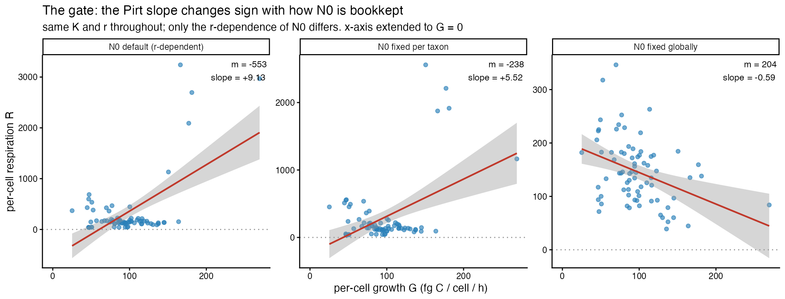
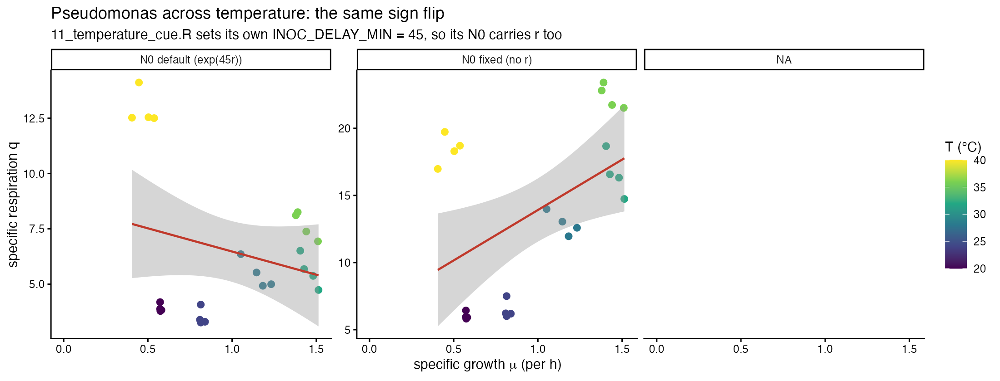
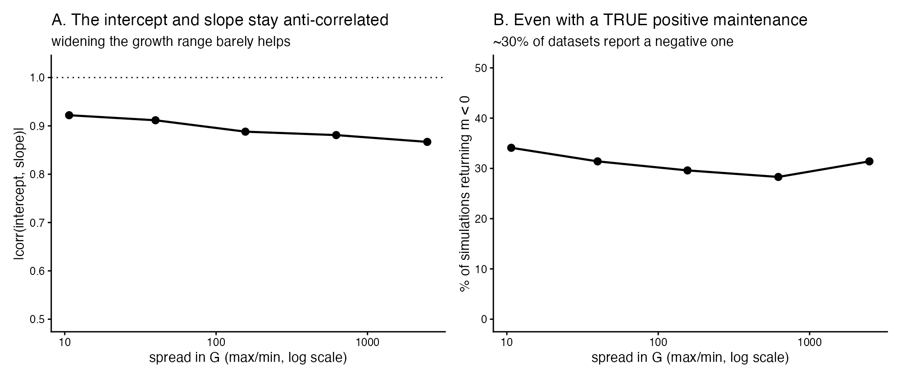

```{r setup}
suppressPackageStartupMessages({ library(tidyverse); library(knitr); library(jsonlite) })
BASE <- normalizePath("../..", mustWork = TRUE)
CMP  <- file.path(BASE, "runs", "D7_analysis")
rd   <- function(f) suppressWarnings(suppressMessages(
  readr::read_csv(file.path(CMP, f), show_col_types = FALSE, progress = FALSE)))
VERS <- local({ p <- file.path(BASE, "env", "versions.json")
  if (file.exists(p)) jsonlite::fromJSON(p) else list() })
vg <- function(..., default = "not recorded") {
  x <- VERS
  for (k in c(...)) { if (!is.list(x) || is.null(x[[k]])) return(default); x <- x[[k]] }
  x <- as.character(x); if (!length(x) || is.na(x[1]) || !nzchar(x[1])) default else x[1]
}
kb <- function(x, ...) knitr::kable(x, booktabs = TRUE, linesep = "", ...)
fm  <- function(x, d = 3) formatC(x, format = "g", digits = d)
sig <- function(p) ifelse(p < 0.001, "***", ifelse(p < 0.01, "**", ifelse(p < 0.05, "*", "ns")))

A1 <- rd("A1_algebra_check.csv"); A3 <- rd("A3_gate_pirt_fits.csv")
A5 <- rd("A5_gate_pseudomonas_fits.csv")
C1 <- rd("C1_fig6_reconciliation.csv"); D1 <- rd("D1_identifiability_observed.csv")
D2 <- rd("D2_identifiability_vs_spread.csv"); D3 <- rd("D3_identifiability_headline.csv")
g <- function(tb, k, col = "value") tb[[col]][tb[[1]] == k]
```

# Verdict {.unnumbered}

```{=latex}
\begin{verdictbox}
```
**No. Maintenance and yield cannot be separated from the data in hand, and this
is a reparameterisation of Figure 6 rather than a new result.**

Both axes of the proposed regression carry the growth rate $r$ by construction:
$G = r \cdot 60 \cdot q$ exactly, and $R = K\,O_{2,ref}/N_0$ with
$N_0 \propto e^{-r\Delta t}$. Holding $N_0$ fixed — changing nothing else — makes
the Pirt slope **change sign**: $`r fm(A3$slope_inv_Y[1], 3)` \to
`r fm(A3$slope_inv_Y[2], 3)` \to `r fm(A3$slope_inv_Y[3], 3)`$ across the three
$N_0$ treatments in the 15-taxon set, and
$`r fm(A5$slope_inv_Y[1], 3)` \to `r fm(A5$slope_inv_Y[2], 3)`$ in
*Pseudomonas*. Whether respiration rises or falls with growth is decided by an
$N_0$ bookkeeping choice. **The gate fails, and no $m$ or $Y$ is carried
forward.**

**Figure 6 was already saying this.** Under $R = m + G/Y$ the elasticity
$d\log R/d\log G$ lies in $(0, 1]$ for *any* non-negative $m$. The published
log-log slope of 0.283 inverts to
$`r fm(g(C1, "implied elasticity d log R / d log G = 1/slope"), 3)`$ — nearly
four times the maximum the Pirt form allows — which is possible only with
negative maintenance. The direct linear fit duly returns
$m = `r fm(A3$m_intercept[1], 4)`$ fg C cell⁻¹ h⁻¹. The two parameterisations
agree; what they agree on is that the decomposition is unavailable.

**And the split is weakly identified anyway.** Simulating from a *known* Pirt
relationship at the observed design gives an intercept–slope sampling
correlation of
`r fm(g(D3, "intercept-slope sampling correlation at the observed design"), 3)`,
a relative precision on $m$ of
`r fm(g(D3, "relative precision of m at the observed design (sd/|m|)"), 3)`, and
**`r fm(g(D3, "% of simulated datasets giving a NEGATIVE m"), 3)`% of datasets
returning a negative maintenance even when the truth is positive.** The data
constrain the *product*, not the split.

**Widening the growth range does not fix it** — the binding constraint is the
residual scale, not the spread. At this noise level, 20% precision on $m$ would
need $n \approx `r format(g(D3, "n needed for 20% relative precision on m, at this noise level"), big.mark = ",")`$
curves. There are `r fm(g(D3, "n actually available"), 3)`.

```{=latex}
\end{verdictbox}
```

# The question, and why it is asked now

The paper's introduction frames respiration as having a maintenance component
independent of growth rate and a growth-associated component proportional to
biomass synthesis. The implemented model has a single lumped per-cell $R$.
Separating them is the Pirt relation

$$R = m + \frac{\mu}{Y}$$

D5 and D6 both returned negative results: the estimator's uncertainty is honest
and its structure is adequate. The Bayesian rebuild originally proposed as a
*fix* is therefore not justified and is not revived here. What remained was
whether the method could deliver a **new capability**, and the cheapest test of
that is a reparameterisation onto linear axes — not a new estimator.

This report fits no oxygen curves, changes no estimator and alters no committed
number.

# The gate: is the regression measuring physiology or construction? {#sec-gate}

## The algebra

From `05_oxygen_fits.R`, under `N0_METHOD = "depletion"`:

$$G = r \cdot 60 \cdot q \qquad\text{($q$ = cell carbon, a per-taxon constant)}$$

$$R = \frac{C_{tot}}{\text{biomass}} = \frac{(K/r)(e^{rT}-1)O_{2,ref}}{N_0 (e^{rT}-1)/r} = \frac{K\,O_{2,ref}}{N_0}, \qquad N_0 = FC\,c\,e^{-r\Delta t}$$

so $R \propto K \, e^{+r\Delta t}$. Both identities were confirmed numerically
rather than asserted:

```{r a1}
A1 |> dplyr::transmute(Check = check, Value = fm(value, 4)) |>
  kb(caption = "The algebra, verified against the committed table.")
```

Both axes carry $r$ — $G$ linearly, $R$ exponentially. D6 found an analogous
case where an apparent predictor turned out to be $r$ in disguise, so this is
tested rather than assumed.

## The test

Recompute $R$ with $N_0$ held fixed — same $K$, same $r$, only the
$r$-dependence of $N_0$ removed.

```{r a3}
A3 |> dplyr::transmute(
  `N0 treatment` = dataset, n = n,
  `m (intercept)` = sprintf("%s %s", fm(m_intercept, 4), sig(m_p)),
  `95% CI` = sprintf("[%s, %s]", fm(m_lo, 3), fm(m_hi, 3)),
  `slope 1/Y` = sprintf("%s %s", fm(slope_inv_Y, 3), sig(slope_p)),
  Y = ifelse(is.na(Y), "—", fm(Y, 3)),
  `R²` = fm(r_squared, 3)) |>
  kb(caption = "15 taxa at 30 °C, n = 75. The slope changes sign.")
```

{#fig-gate width=100%}

The slope runs $`r fm(A3$slope_inv_Y[1], 3)` \to `r fm(A3$slope_inv_Y[2], 3)`
\to `r fm(A3$slope_inv_Y[3], 3)`$. Whether the yield is even *positive* — whether
respiration rises or falls with growth — is decided by how $N_0$ is bookkept.
The maintenance intercept is negative and significant under the default
construction, which is physically impossible.

## The same test on *Pseudomonas*

**A construction detail the brief did not flag:** `11_temperature_cue.R` sets its
own `INOC_DELAY_MIN <- 45` at line 40, overriding `config.R`'s 0, so its
$N_0 = 550\,e^{45r}$ carries $r$ too. B2 is not the clean within-taxon comparison
it appears to be — it has the same contamination in the opposite direction.

```{r a5}
A5 |> dplyr::transmute(
  `N0 treatment` = dataset, n = n,
  `m (intercept)` = fm(m_intercept, 4),
  `95% CI` = sprintf("[%s, %s]", fm(m_lo, 3), fm(m_hi, 3)),
  `slope 1/Y` = sprintf("%s %s", fm(slope_inv_Y, 3), sig(slope_p)),
  Y = ifelse(is.na(Y), "—", fm(Y, 3)),
  `R²` = fm(r_squared, 3)) |>
  kb(caption = "Pseudomonas, 20–40 °C, n = 24. The slope flips the other way.")
```

{#fig-gate2 width=100%}

**Both datasets fail the gate.** Per the brief, parameter fitting stops here:
the numbers above are gate diagnostics, not maintenance and yield estimates, and
none is carried forward. Because the gate failed, the two datasets are *not*
pooled and no temperature dependence of $m$ is fitted — doing so would be fitting
structure to an artefact.

# Reconciliation with Figure 6 {#sec-fig6}

Figure 6 regresses $\log G \sim \log R_c$ with $(1|\text{Taxon})$ — the
random-slope form was found singular in D5/D6 — and reports a slope of 0.283.
Refitting here with the *same* random-effects structure, so only the
parameterisation differs:

```{r c1}
C1 |> dplyr::transmute(Quantity = quantity, Value = fm(value, 4)) |>
  kb(caption = "What the published log-log slope implies about maintenance.")
```

Under $R = m + G/Y$,

$$\frac{d\log R}{d\log G} = \frac{G/Y}{m + G/Y} \in (0, 1] \quad \text{for any } m \geq 0$$

approaching 1 as $m \to 0$. The published slope inverts to an elasticity of
`r fm(g(C1, "implied elasticity d log R / d log G = 1/slope"), 3)`, nearly four
times that ceiling. **Figure 6 was already implying negative maintenance**, and
the direct linear fit returns exactly that. The two parameterisations do not
disagree — they agree the decomposition is unavailable.

Worse, the sign is not stable across parameterisations of the same data:

| parameterisation | implied $m$ |
|---|---|
| forward log-log, inverted | `r fm(g(C1, "implied maintenance m from the Fig 6 elasticity"), 4)` |
| direct linear fit | `r fm(g(C1, "maintenance m from the DIRECT linear Pirt fit (PART A)"), 4)` |
| reverse regression $\log R \sim \log G_c$ | `r fm(g(C1, "implied maintenance m from the reverse regression"), 4)` |

Regression is not symmetric under scatter, so these need not agree numerically.
But a quantity whose **sign** depends on which variable is placed on the left is
not a measurement.

# Identifiability, setting the artefact aside {#sec-ident}

Even if $R$ on $G$ were pure physiology, could $m$ and $Y$ be recovered at this
design? Simulating from a known Pirt relationship ($m$ = 20% of mean observed
$R$, $Y = 0.3$) at the observed $G$ values and residual scale, 2000 draws:

```{r d3}
D3 |> dplyr::transmute(Quantity = quantity, Value = fm(value, 4)) |>
  kb(caption = "Identifiability at the observed design.")
```

{#fig-ident width=100%}

```{r d2}
D2 |> dplyr::transmute(
  `widen factor` = widen_factor,
  `G spread (max/min)` = fm(G_spread_ratio, 4),
  `corr(intercept, slope)` = fm(corr_intercept_slope, 3),
  `rel. precision of m` = fm(m_rel_precision, 3),
  `% m < 0` = fm(pct_m_negative, 3)) |>
  kb(caption = "Widening the growth range barely helps.")
```

The intercept and slope are anti-correlated at
`r fm(g(D3, "intercept-slope sampling correlation at the observed design"), 3)` —
the standard failure mode for this analysis. **The data constrain the product,
not the split.**

Rescaling $G$ to spreads of 40×, 156×, 621× and 2483× moves the correlation only
from −0.92 to −0.87 and the relative precision from 2.31 to 1.75. The binding
constraint is not the spread of $G$ but the residual scale relative to $m$:
$\sigma = `r fm(g(D3, "residual sd used (from the observed fit)"), 4)`$ against a
true $m$ of `r fm(g(D3, "assumed true m (20% of mean R)"), 3)`.

# What it means {#sec-means}

> **Maintenance and yield cannot be separated from the data already in hand, and
> what a Pirt reparameterisation produces here is not a new result but a
> restatement of Figure 6.** Both axes carry the growth rate by construction —
> $G = 60qr$ exactly, and $R = K O_{2,ref}/N_0$ with $N_0 \propto e^{-r\Delta t}$
> — and when $N_0$ is held fixed, changing nothing else, the Pirt slope changes
> sign in both experiments (9.13 → 5.52 → −0.59 across the 15 taxa; −2.10 → +7.50
> in *Pseudomonas*, whose stage-11 code sets its own 45-minute inoculation delay).
> A slope whose sign is set by an $N_0$ bookkeeping choice is not physiology.
> Figure 6 already implied as much: under $R = m + G/Y$ the elasticity
> $d\log R/d\log G$ cannot exceed 1 for non-negative maintenance, and the
> published 0.283 inverts to 3.79 — so the figure was always describing a fit
> whose implied maintenance is negative, which the direct linear fit confirms at
> −553 fg C cell⁻¹ h⁻¹. Even setting the artefact aside, the split is weakly
> identified at this design: intercept and slope are anti-correlated at −0.93,
> the relative precision on $m$ is 2.3, and 32% of simulated datasets return a
> negative maintenance when the truth is positive. **The classical remedy — a
> wider range of growth rates at fixed temperature, via a substrate-limited
> chemostat or dilution series — is indeed what is required, but this analysis
> shows it is necessary and not sufficient: widening the range 2483-fold leaves
> the intercept–slope correlation at −0.87, because the binding constraint is the
> residual scale rather than the spread. Separating $m$ from $Y$ here would need
> both a wider growth range and roughly two orders of magnitude more curves
> ($n \approx 9{,}900$ against the 75 available), or a materially lower residual
> scale on $R$ — which returns to the unresolved $N_0$ calibration D2 identified.**

## New result, or reparameterisation?

**A reparameterisation.** The linear Pirt fit and the published log-log figure
are two ways of writing the same regression on the same 75 points, and they give
consistent answers. Nothing here adds information the published figure did not
already contain; what it adds is the *interpretation* — that the figure's slope
is outside the range Pirt allows, and why.

# Provenance {.unnumbered}

```{r prov}
tibble::tibble(
  Field = c("Report", "Git commit (environment record)", "Branch",
            "Environment recorded (UTC)", "R", "Platform",
            "renv lockfile", "Artefact tree", "Seed"),
  Value = c("D7 — Pirt maintenance/yield",
            vg("git", "commit"), vg("git", "branch"), vg("recorded_utc"),
            vg("R", "version"), vg("R", "platform"),
            paste0("renv.lock — ", vg("renv", "n_packages"), " packages, R ",
                   vg("renv", "lockfile_R")),
            "runs/D7_analysis/", "simulation seed 20260808")
) |> kb(caption = "Provenance. Environment fields come from env/versions.json.")
```

## Where every number came from {.unnumbered}

```{r map}
tibble::tribble(
  ~Section, ~Artefact,
  "§3.1 algebra",        "A1_algebra_check.csv",
  "§3.2 the gate",       "A2_gate_per_curve.csv, A3_gate_pirt_fits.csv",
  "§3.3 Pseudomonas",    "A4_gate_pseudomonas_per_curve.csv, A5_gate_pseudomonas_fits.csv",
  "§4 Fig 6",            "C1_fig6_reconciliation.csv",
  "§5 identifiability",  "D1_identifiability_observed.csv, D2_identifiability_vs_spread.csv, D3_identifiability_headline.csv"
) |> kb(caption = "All paths relative to runs/D7_analysis/.")
```

Scripts are in `reports/D7_pirt/scripts/`. No number was typed by hand.
