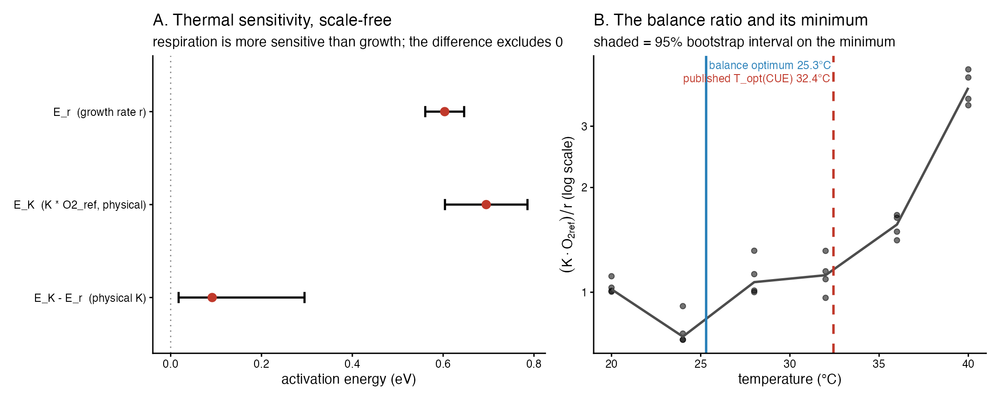
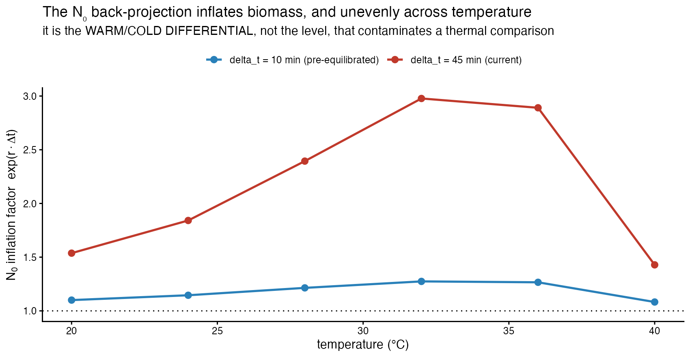
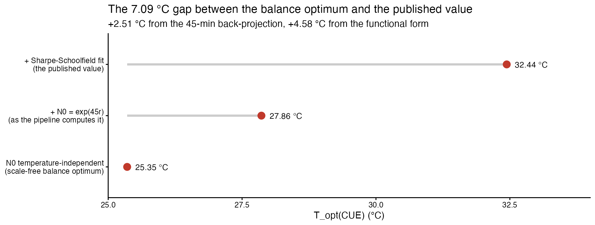
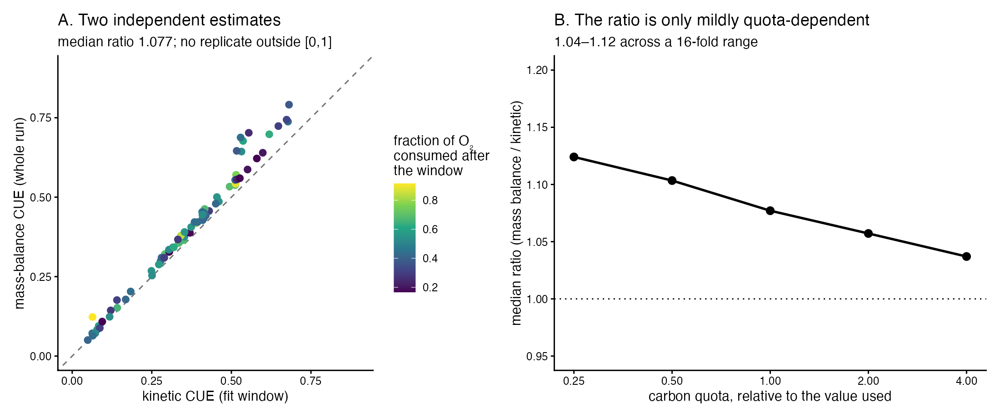

```{r setup}
suppressPackageStartupMessages({ library(tidyverse); library(knitr); library(jsonlite) })
BASE <- normalizePath("../..", mustWork = TRUE)
CMP  <- file.path(BASE, "runs", "D8_analysis")
rd   <- function(f) suppressWarnings(suppressMessages(
  readr::read_csv(file.path(CMP, f), show_col_types = FALSE, progress = FALSE)))
VERS <- local({ p <- file.path(BASE, "env", "versions.json")
  if (file.exists(p)) jsonlite::fromJSON(p) else list() })
vg <- function(..., default = "not recorded") {
  x <- VERS; for (k in c(...)) { if (!is.list(x) || is.null(x[[k]])) return(default); x <- x[[k]] }
  x <- as.character(x); if (!length(x) || is.na(x[1]) || !nzchar(x[1])) default else x[1] }
kb <- function(x, ...) knitr::kable(x, booktabs = TRUE, linesep = "", ...)
fm <- function(x, d = 3) formatC(x, format = "g", digits = d)
A2 <- rd("A2_activation_energies.csv"); A3 <- rd("A3_argmin_and_foldchange.csv")
A5 <- rd("A5_taxon_ranking_30C.csv");   B2 <- rd("B2_N0_expfactor_by_temperature.csv")
B4 <- rd("B4_Topt_under_N0_treatments.csv"); B5 <- rd("B5_preequilibration_projection.csv")
B6 <- rd("B6_Topt_gap_decomposition.csv");   C2 <- rd("C2_massbalance_by_taxon.csv")
C3 <- rd("C3_massbalance_headline.csv");     C5 <- rd("C5_ratio_sensitivity_to_quota.csv")
g  <- function(tb, k, col = "value") tb[[col]][tb[[1]] == k]
```

# Verdict {.unnumbered}

```{=latex}
\begin{verdictbox}
```
**The balance conclusions are secure without resolving the absolute scale — and
the published CUE optimum sits 7 °C above the scale-free balance optimum, for
reasons that have nothing to do with scale.**

With $G \propto r$ and $R \propto K\,O_{2,ref}$, CUE $= 1/(1 + (c/q)(K
O_{2,ref})/r)$, so the argmax of CUE is the **argmin of $(K O_{2,ref})/r$** and
the constant $c/q$ — carrying `FC_TO_CELLS_PER_L`, the carbon quota, RQ and the
absolute $N_0$ — drops out. Measured:

$E_r = `r fm(A2$E_eV[1], 3)`$ eV, $E_K = `r fm(A2$E_eV[3], 3)`$ eV,
$E_K - E_r = `r fm(A2$E_eV[4], 2)`$ eV
[`r fm(A2$E_lo[4], 2)`, `r fm(A2$E_hi[4], 2)`] — **respiration is more
temperature-sensitive than growth, and the interval excludes zero.** The balance
optimum is **`r fm(g(A3, "argmin (K*O2_ref/r)  [solubility-corrected]"), 4)` °C**
[`r fm(A3$lo[2], 4)`, `r fm(A3$hi[2], 4)`].

**One correction to the brief:** the scale-free ratio is $(K\,O_{2,ref})/r$, not
$K/r$. $K$ lives on the *normalised* trace, and $O_{2,ref}$ is oxygen solubility,
which falls `r fm(g(A3, "O2_ref at 20 C / O2_ref at 40 C"), 3)`-fold across
20–40 °C. Using $K/r$ moves the optimum by 1.35 °C.

**The published $T_{opt}$(CUE) is 32.44 °C.** The 7.09 °C gap decomposes cleanly
— after verifying that the CUE reconstructed here reproduces the pipeline's own
column to `r fm(B6$value_C[7], 2)`:

| | |
|---|---|
| $N_0$ temperature-independent | `r fm(B6$value_C[1], 4)` °C |
| $+$ the 45-min back-projection | `r fm(B6$value_C[2], 4)` °C (**+`r fm(B6$value_C[4], 3)`**) |
| $+$ Sharpe–Schoolfield fit (published) | `r fm(B6$value_C[3], 4)` °C (**+`r fm(B6$value_C[5], 3)`**) |

About a third is the back-projection; two thirds is the **functional form**.
Neither is a scale problem: resolving the $N_{inoc}$ discrepancy would close
neither.

**The mass-balance check passes.** An entirely independent CUE — from
$FC_{final}-FC_{initial}$ and raw oxygen drawdown, needing no $N_0$ and no
back-calculation — gives `r fm(g(C3, "median CUE, mass balance (whole run)"), 4)`
against the kinetic `r fm(g(C3, "median CUE, kinetic (fit window)"), 4)`, a
**ratio of `r fm(g(C3, "median ratio massbalance / kinetic"), 4)`** (IQR
`r fm(g(C3, "IQR of that ratio"), 2)`), with
**`r fm(g(C3, "replicates with CUE outside [0,1] or FC_Final <= FC_Initial"), 1)`
of 75 replicates physically impossible.** The kinetic method survives an external
check it could easily have failed.

```{=latex}
\end{verdictbox}
```

# Why this analysis

D5, D6 and D7 all returned negative results on the estimator: its uncertainty is
honest, its structure is adequate, and the maintenance/yield split is not
identifiable. The one open problem, from D2, is the **absolute** respiration
scale.

This report tests the observation that the *balance* question does not need any
of it. It fits no new curves, changes no estimator and alters no committed
number.

# The scale-free quantities {#sec-scalefree}

## The algebra

In `11_temperature_cue.R`, growth $\propto r \cdot N_0 \cdot q$ and respiration
$\propto K \cdot O_{2,ref}$, so

$$\mathrm{CUE} = \frac{G}{G+R} = \frac{1}{1 + \dfrac{c}{q}\cdot\dfrac{K\,O_{2,ref}}{r}}$$

Maximising CUE means minimising $(K O_{2,ref})/r$, and $c/q$ — which is where
`FC_TO_CELLS_PER_L`, the quota, RQ and the absolute $N_0$ live — vanishes from
the argmin.

> **Correction to the brief.** It writes the ratio as $K/r$. But $K$ is defined
> on the *normalised* oxygen trace, so the physical consumption rate is
> $K\,O_{2,ref}$, and $O_{2,ref}$ is solubility: median 7.21 mg/L at 20 °C
> falling to 5.31 at 40 °C. Both versions are reported; they differ by 1.35 °C
> in the optimum.

## What it gives

```{r a2}
A2 |> dplyr::transmute(Quantity = quantity, n = n,
  `peak (°C)` = ifelse(is.na(T_peak_C), "—", fm(T_peak_C, 3)),
  `E (eV)` = fm(E_eV, 3),
  `95% CI` = sprintf("[%s, %s]", fm(E_lo, 3), fm(E_hi, 3))) |>
  kb(caption = "Boltzmann–Arrhenius on the rising limb, Pseudomonas 20–40 °C.")
```

{#fig-sf width=100%}

```{r a3}
A3 |> dplyr::transmute(Quantity = quantity, Value = fm(value, 4),
  `95% CI` = ifelse(is.na(lo), "—", sprintf("[%s, %s]", fm(lo, 4), fm(hi, 4)))) |>
  kb(caption = "The balance optimum and the shift across the range.")
```

## The list that is the point of this report

**Carrying no dependence on `FC_TO_CELLS_PER_L`, the carbon quota, RQ or the
absolute $N_0$ scale:** $E_r$; $E_K$; $E_K - E_r$; the argmin of
$(K O_{2,ref})/r$, i.e. $T_{opt}$(CUE); the fold-change in that ratio across the
measured range; and the between-taxon **ranking** at 30 °C. These are functions
of the fitted $r$ and $K$ and of measured oxygen solubility, nothing else.

**Depending on those constants, and therefore inheriting D2's unresolved scale:**
the *level* of CUE, absolute per-cell $R$, absolute per-cell $G$, and the
maintenance/yield split D7 showed is unidentifiable anyway.

The 15-taxon set at 30 °C gives a single temperature, so it supports a ranking
and no thermal sensitivity:

```{r a5}
A5 |> dplyr::slice(c(1:3, (dplyr::n()-2):dplyr::n())) |>
  dplyr::transmute(Rank = rank_best_balance, Taxon = Taxon,
                   `median (K·O₂ref)/r` = fm(median_ratio_phys, 4)) |>
  kb(caption = "Best and worst balance at 30 °C (ranking only; 15 taxa).")
```

# How far does the N₀ temperature dependence contaminate this? {#sec-n0}

The scale-free argument holds only if $N_0$ is temperature-independent. It is
not: `11_temperature_cue.R` sets $N_0 = 550\times10^3 e^{45r}$.

```{r b2}
B2 |> dplyr::transmute(`T (°C)` = Temperature, `median r (/min)` = fm(median_r, 4),
  `exp(45r)` = fm(median_expfac_45min, 4),
  `exp(10r)` = fm(median_expfac_10min, 4)) |>
  kb(caption = "The N₀ inflation factor, by temperature.")
```

{#fig-n0 width=80%}

$N_0$ is inflated by 43–198% depending on temperature. It is the **warm/cold
differential**, not the level, that contaminates a thermal comparison.

## The gap, decomposed

```{r b6}
B6 |> dplyr::slice(1:6) |>
  dplyr::transmute(Step = step, `°C` = fm(value_C, 4)) |>
  kb(caption = "From the scale-free balance optimum to the published value.")
```

{#fig-gap width=90%}

**The check the brief asked for passes.** With $N_0$ held
temperature-independent the CUE argmax is
`r fm(B4$T_opt_CUE[2], 4)` °C against an argmin of $(K O_{2,ref})/r$ of
`r fm(B4$argmin_ratio_phys[1], 4)` °C — the same quantity, as the algebra
requires. $E_r$ and the argmin are unaffected by $N_0$ treatment by construction;
verified, not assumed.

## The `INOC_DELAY_MIN` override

`config.R` sets `INOC_DELAY_MIN <- 0`; `11_temperature_cue.R` line 40 sets its
own `45`. Reported both ways rather than reconciled:

```{r b4}
B4 |> dplyr::transmute(`N₀ treatment` = treatment, `T_opt(CUE) °C` = fm(T_opt_CUE, 4)) |>
  kb(caption = "T_opt(CUE) under each treatment.")
```

**The published figure used 45** — confirmed by reproducing its
`carbon_use_efficiency` column to `r fm(B6$value_C[7], 2)`.

## Pre-equilibration

```{r b5}
B5 |> dplyr::filter(!is.na(temperature_C)) |>
  dplyr::transmute(`T (°C)` = temperature_C, `Δt (min)` = delta_t_min,
    `exp(rΔt)` = fm(median_expfactor, 4), `inflation` = sprintf("%.1f%%", pct_inflation)) |>
  kb(caption = "Pre-equilibrating the medium to Δt ≈ 10 min.")
```

Inflation falls from 54%/43% (cold/warm) to **10%/8%**, and the warm–cold
differential from `r fm(B5$median_expfactor[5], 3)` to
`r fm(B5$median_expfactor[6], 3)`. Most of the contamination goes.

# The independent mass-balance check {#sec-mb}

Biomass carbon produced $=(FC_{final}-FC_{initial})\times$
`FC_TO_CELLS_PER_L` $\times$ quota; carbon respired $=$ total drawdown $\times$
$O_2\!\to\!C$ $\times 10^{12}$. Both per litre, so **vial volume cancels** —
fortunate, since none is recorded in the repository.

> **These are different estimands.** The kinetic CUE is instantaneous over the
> *fit window*; the mass-balance CUE integrates the *whole run*, including the
> post-window decline. A median
> `r sprintf("%.1f%%", 100*g(C3, "median fraction of O2 consumed AFTER the window closed"))`
> of the oxygen is consumed after the window closes.

```{r c3}
C3 |> dplyr::transmute(Quantity = quantity, Value = fm(value, 4)) |>
  kb(caption = "Kinetic against mass-balance CUE.")
```

{#fig-cue width=100%}

**Two estimates sharing no kinetic machinery agree to within 8%**, and not one
of 75 replicates is physically impossible.

## Two things this analysis got wrong going in

**1. The predicted direction was wrong.** I expected the integrated CUE to be
systematically *lower*, since the post-window tail is maintenance-dominated. It
is **7.7% higher**, and the gap does not track the post-window oxygen fraction
($r = `r fm(g(C3, "corr(ratio, fraction of O2 post-window)"), 3)`$,
$p = `r fm(g(C3, "  its p-value"), 2)`$). The maintenance-tail story is not
supported by these data.

**2. The brief's claim that the ratio cancels the quota is not true.** Both CUEs
have the form $1/(1+A/q)$, so their ratio is $(1+B/q)/(1+A/q)$, which depends on
$q$. Tested rather than assumed:

```{r c5}
C5 |> dplyr::transmute(`quota ×` = quota_scale,
  `mass-balance CUE` = fm(median_CUE_massbalance, 3),
  `kinetic CUE` = fm(median_CUE_kinetic, 3),
  `ratio` = fm(median_ratio, 4)) |>
  kb(caption = "The ratio is quota-dependent, but only mildly.")
```

Across a **16-fold** range the ratio stays between 1.04 and 1.12. The agreement
is robust to the quota even though it is not formally independent of it — the
honest version of the brief's claim.

```{r c2}
C2 |> dplyr::transmute(Taxon, n,
  `mass-balance` = fm(CUE_massbalance, 3), `kinetic` = fm(CUE_kinetic, 3),
  `ratio` = fm(ratio, 4), `impossible` = n_impossible) |>
  kb(caption = "By taxon. Every taxon agrees within 27%, eleven of fifteen within 10%.")
```

# What it means {#sec-means}

> **The growth–respiration balance is secure without resolving the absolute
> scale.** The activation energies ($E_r = 0.60$ eV, $E_K = 0.69$ eV), their
> difference ($E_K - E_r = 0.09$ eV, 95% CI [0.02, 0.29] — respiration is the
> more temperature-sensitive, and the interval excludes zero), the balance
> optimum (25.3 °C, 95% CI [24.0, 26.1]), the 5.2-fold shift in the balance
> across 20–40 °C, and the between-taxon ranking at 30 °C are all functions of
> the fitted $r$ and $K$ and of measured oxygen solubility. **None of them
> touches `FC_TO_CELLS_PER_L`, the carbon quota, RQ or the absolute $N_0$**, so
> none is exposed to the D2 discrepancy. What *is* exposed is the LEVEL of CUE
> and absolute per-cell respiration, which should carry a stated uncertainty
> rather than a point value until the $N_{inoc}$ calibration is settled. The
> published $T_{opt}$(CUE) of 32.44 °C sits 7.09 °C above the scale-free balance
> optimum, and the reason is *not* scale: about +2.5 °C comes from the 45-minute
> $N_0$ back-projection that `11_temperature_cue.R` applies (and which a 10-minute
> pre-equilibration would largely remove, cutting inflation from 54%/43% to
> 10%/8%), and about +4.6 °C from the Sharpe–Schoolfield functional form rather
> than the data. **Finally, the kinetic method passes an external check it could
> have failed:** an entirely independent mass-balance CUE, using only cell counts
> and raw oxygen drawdown and requiring no $N_0$ at all, agrees to within 8%
> (ratio 1.077, IQR 0.044) with no physically impossible replicate in 75. The two
> CUEs are different estimands and the small gap should not be read as an error
> in either — but agreement at this level is real evidence that the kinetic
> machinery is sound, which is consistent with D5, D6 and D7.

## Recommendation on reporting

**Lead with:** $E_r$, $E_K$, $E_K - E_r$, the balance optimum with its interval,
the fold-change in $(K O_{2,ref})/r$, and taxon rankings. These are
scale-invariant and defensible today.

**Carry a stated uncertainty, not a point value:** the level of CUE, absolute
per-cell $R$ and $G$. These inherit D2's unresolved $N_{inoc}$ discrepancy.

**Two specific fixes, neither requiring new biology:** reconcile the
`INOC_DELAY_MIN` override (0 in `config.R`, 45 in `11_temperature_cue.R`) and
state which is intended; and report $T_{opt}$(CUE) from the balance ratio
alongside the Sharpe–Schoolfield value, since two thirds of their difference is
the fitted curve rather than the measurements.

# Provenance {.unnumbered}

```{r prov}
tibble::tibble(
  Field = c("Report", "Git commit", "Branch", "Recorded (UTC)", "R", "Platform",
            "renv lockfile", "Artefacts", "Seed"),
  Value = c("D8 — balance and mass balance", vg("git","commit"), vg("git","branch"),
            vg("recorded_utc"), vg("R","version"), vg("R","platform"),
            paste0("renv.lock — ", vg("renv","n_packages"), " packages, R ",
                   vg("renv","lockfile_R")),
            "runs/D8_analysis/", "bootstrap seed 20260808")) |>
  kb(caption = "Provenance. Environment fields from env/versions.json.")
```

## Where every number came from {.unnumbered}

```{r map}
tibble::tribble(
  ~Section, ~Artefact,
  "§3 scale-free", "A1_pseudomonas_scale_free.csv, A2_activation_energies.csv, A3_argmin_and_foldchange.csv, A4_, A5_taxon_ranking_30C.csv",
  "§4 N₀ dependence", "B1_, B2_N0_expfactor_by_temperature.csv, B3_, B4_Topt_under_N0_treatments.csv, B5_preequilibration_projection.csv, B6_Topt_gap_decomposition.csv",
  "§5 mass balance", "C1_massbalance_per_replicate.csv, C2_, C3_massbalance_headline.csv, C4_physically_impossible.csv, C5_ratio_sensitivity_to_quota.csv"
) |> kb(caption = "All paths relative to runs/D8_analysis/.")
```

Scripts are in `reports/D8_balance/scripts/`. No number was typed by hand.
